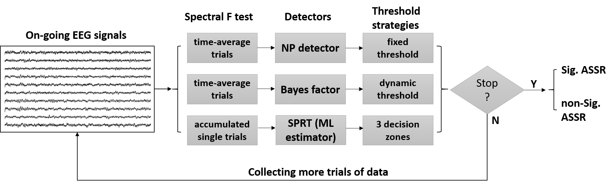
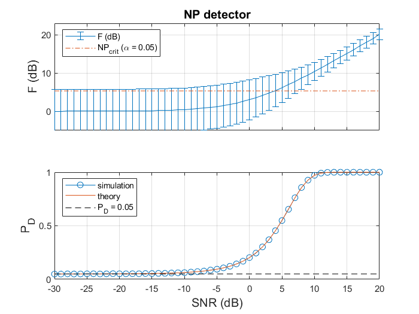
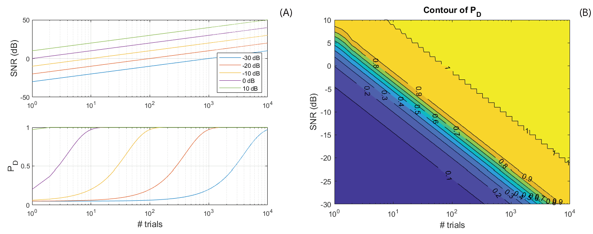
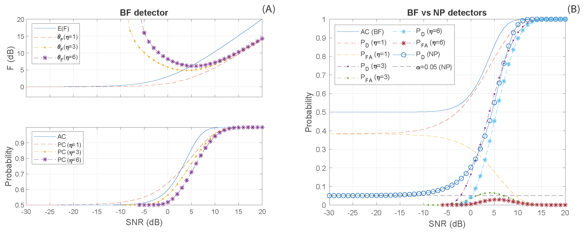
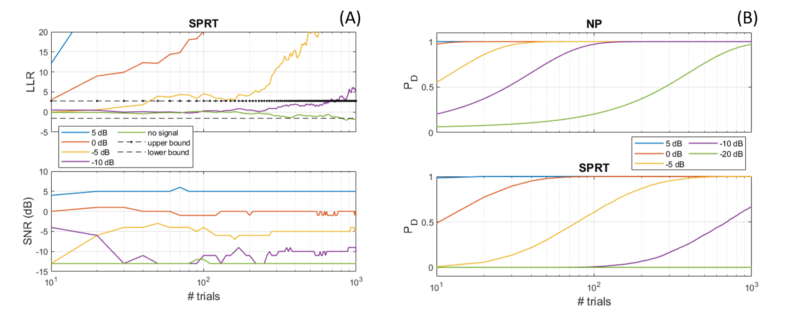
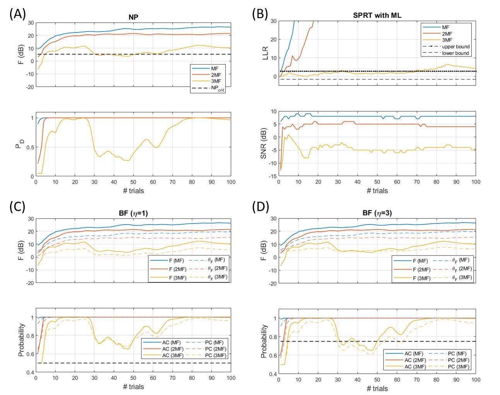
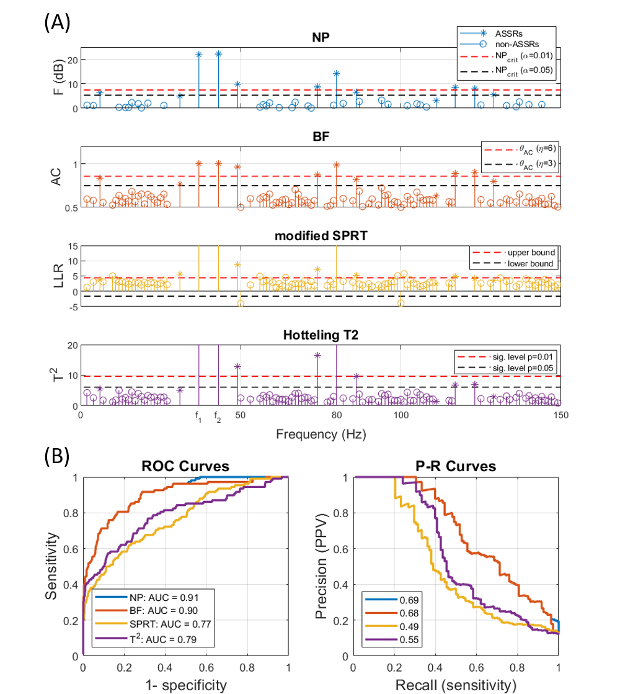

# ASSR-Realtime-Detectors
Matlab scripts for the paper, Towards real-time detection of auditory steady-state responses: a comparative study.
Paper will be available soon.

<p align="center">
    </a>
</p>


First, download this repo:
```
git clone git@github.com:ieeeWang/ASSR-Realtime-Detectors.git
```


In Matlab, under the download foler 'ASSR-Realtime-Detectors', run the following scripts to get the simulation for the Neyman-Pearson detector:
```
NP_detect_s1.m
NP_detect_s2.m
```
Some results will be like:

<p align="center">
    </a>
</p>

<p align="center">
    </a>
</p>

Second, run the following scripts to get the simulation for the Bayes-factor detector:
```
BF_detect_s1.m
```
Some results will be like:
<p align="center">
    </a>
</p>


Third, run the following scripts to get the simulation for the SPRT detector:
```
SPRT_s1.m
SPRT_s2.m
```
Some results will be like:



The real EEG data (one-channel on FCz) is availabe in the folder 'data', run the following scripts to test the detectors:
```
EEG_demo1.m
EEG_demo1b.m
```
Some results will be like:



Finally, performance evaluation can be done by run (using saved intermediate results in the folder 'data'):
```
plot_ROC_PR_curves.m
plot_boxplot_trialNo.m
```
Some results will be like:

